**B1ST**
-------

a Premium Ticketing System 

Copyright © 2016-2022  by EGY1ST Software & ZeroBytes for Deep Learning.

B1ST a  Free but Premium Ticketing System

**Table of contents**

1. Introduction
2. About B1ST Ticketing System
3. What's new
4. Getting Started
5. System requirements
6. Installation
7. Integration
8. First login
9. Modules
10. Adding Basic Data
11. Adding new Company
12. Adding new Department
13. Adding Ticket's Priorities
14. Ticketing
15. Adding Tickets
16. Receiving emails as tickets
17. Receiving Tweets as tickets
18. Ticket's Status
19. Filtering Tickets
20. Searching for a Ticket
21. Statistics
22. Product's Functionality
23. Adding new Product
24. Adding FAQs
25. Canned Messages
26. Knowledge-Base
27. Customization
28. Themes
29. Languages
30. Responsiveness
31. Configuration & Settings
32. Settings
33. How to configure TS
34. Security & Safety
35. Backup data & Restore them
36. Virus Protection
37. Spam Detection & prevention
38. Admins & Privileges
39. Adding Admin/Users
40. Setting Privileges
41. Extras
42. Chat with clients
43. Mobile Verification
44. Attaching & Uploading Files
45. Rating System
46. Response Time
47. Auto-Respond Message
48. grAvatar
49. reCAPTCHA 

**Introduction**

**About B1ST Ticketing System**

Fledged with Premium Features 

Either small or medium company you own but your search for the ideal PHP Ticketing System has come to an end. B1st bears all in one ticketing solution to help you meet your changing needs. We offer you the control, privacy, protection, and flexibility that you and your company desire and deserve. It can be integrated seamless with any HTML , PHP or ASP  websites in addition to major CMS platforms such as WordPress, Joomla, Drupal and Prestshop. B1ST is  not only easy-to-use but also B1ST is constantly developing every day to help clients to meet  their changing needs over time. 

Simple Installation Wizard 

B1st provides smart and simple Installation wizard allows one click installation for common users. 

Users Friendly Interface 

B1ST comes in a Friendly User Interface as users easily can navigate, learn and teach final users without any expertness needed. 

Elegant Message Board 

` `B1st Message board has an easy to use interface, which shows a message meta-data, enables admin to control message by replying to it, closing the issue, or even deleting it.  

Strict Spam Detection & Prevention 

B1ST prevents spam by using 2 layers of authentication. 

- The first prevention layer by enabling reCAPTCHA to stop bot messages. 
- The second layer by integrating A.kis.met, the best-automated spam killer that actually gets better as it learns. 

Malware & Virus Protection 

B1ST makes use of OPSWAT Metascan API to scan any files attached to customers' messages; thus ensuring it is clean and not infected by any virus or malware that may damage your server security. It also allows auto multi scanning facilities using more than 40 engines. 

Multiple company profiles 

B1ST allows you to create multiple companies’ profiles in a single install and maintain them from one place.  

Multiple Divisions & Departments 

B1ST allows a customer to send his inquiry to the proper product department whether it is the sales, support, billing, affiliation, participation, or whatever department you define in the admin panel. 

Multiple Products 

B1ST allows a customer to send his inquiry to the proper product department’ support team; thus, if you have multiple products, each message will be sent to the proper department. 

Multiple Admin Roles facilities 

B1ST allows you to set up multiple admin roles on same domain and same installation. You can authorize who can view, reply, close, delete messages or else as authorized.  For example, you can authorize who can close or delete messages, while allowing someone else to only close them, or you may not authorize him to close or delete messages, but just to reply to them. 

Universal Email Integration 

No matter what your email provider is, B1ST will allow you to receive your emails directly to your message board. B1ST can be integrated to receive any Gmail, Yahoo, AOL, Plesk, and cPanel accounts.  As a double- spam protection, A.Kis.Met API will scan these messages in addition to the detection methods used by your email provider. Finally, if these messages have any attachments, OPSWAT Metascan API will scan them for any virus or malware. 

Canned Message System 

B1ST allows you to reply directly from message using canned messages stored previously as FAQ,; thus you do not have to write anything, just choose an answer and insert it directly with one-click.  

Twitter direct message’s notification system 

B1ST integrates with Twitter API to receive and send direct message notifications; thus, you can make use of social network and keep in touch with your clients to get to know new issues.  

Integrated FAQ System 

B1ST adds as many frequently asked questions on a product-basis. These FAQs cab be used later for fast reply using the ingrated canned-messages system. 

Integrated Knowledge-based System 

B1ST adds as many technical topics on a product-basis. Each group of topics is associated with one category; thus, you can show help on topic basis rather than product basis. For example, all configuration topics for all products appear under the same category.  

Fully Customizable & Configurable  

B1ST is fully customized. comes with 8 built-in styles for your frontend & backend in addition to the capability to create any new styles of yours with no limit. Even, you can set a style color for your fronend while set different style for the backend. On the other hand all premium modules can be switched on & off per your needs. 

Auto Database Backup & Restore 

Rest assure that you can restore your data back in case you faced any suddenly data loss. B1ST allows you to generate backup of your messages database on a period-basis, as many as you wish to. These backups can be restored later easily with a push of a button. 

Multiple locale language files 

B1ST comes with 6 built-in languages English, French, Arabic, German, Spanish & Indian. You can edit or add your locale per your needs. Even more you can set a language (e.g. English) for backend while set another one (e.g. Arabic) for frontend. 

Messages statics & Monitoring 

B1ST gives you clear insight about your messages breakdown according to a message's state, and its priority. In addition, a breakdown over products, department and companies provided. Finally, monitor your messages rating & its response time; thus, you can measure your customers’ satisfaction. 

Messages Filter, Search & Targeting 

- From a frontend perspective, messages can be delivered to special divisions and special products with a specific priority. 
- On the other hand, from a backend perspective, messages can be filtered by divisions, products, and priorities; even more, they can be searched by email and ticket number. 

Scanned Uploads & Attachment 

B1ST allows your customers to attach files to their messages. But do not worry; you are still safe thanks to 

OPSWAT Metascan API. These attachments will be scanned using 40+ online virus & malware engines. Rest assured, you are in safe hands. 

Autoresponder Message 

B1ST can be configured to respond automatically to each message received on your message board; thus, customers make sure their messages are delivered to you.  

Globally Recognized Avatar 

B1ST Shows you and your customer's grAvatar next to each message and their replies; that makes sense. Thus, you are a globally recognized avatar. 

Well-Documented 

B1ST documentation is well-written in an easy but professional way to fulfill all inquiries that you may think of. 

Advanced Rating System 

B1ST allows advanced rating system where users can vote for each answer they receive as a reply from Admins. This helps a lot with the aid of Admin-Status where admin can check his average rating he received with regard to overall rating received from all other Admins.  Also, an Admin can check how many bad rates he received. 

Elastic Ticket Priority 

B1ST gives you the ability to add ticket priority as desired. For example, you may name it (Urgent, High, Normal & Low). You may set it only to less  priorities or increase it to whatever you like. 

Mobile verification 

The most selling feature in B1ST ticketing system is that  it allows you to make sure the users enter a valid mobile numbers where you call back anytime. user will receive a missed call from Cognalys.com. he should enter the last five digits of calling number to validate its mobile number. If he provided wrong last five digits of calling number he will be prevented from registrations 

Advanced Response time system 

B1ST allows you to measure your average response times for all tickets replied by an admin. This helps a lot with the aid of Admin-Status where admin can check his response time  with regard to a threshold defined by Super-Admin. 

Responsive design 

B1ST will show properly on most devices. Thanks to responsive template used based on 16 column grid. 

Seamless Integration 

Frontend of B1ST  can be integrated seamless any HTML , PHP or ASP  websites in addition to major CMS platforms such as WordPress, Joomla, Drupal and Prestshop. All you need to do is to integrate frontend URL as iframe. 

In Addition to 

- Based on Code Ignitor Framework 
- Adhere to PSR4  
- Code is well-commented & organized 
- 1800+ hours of development &  300+ hours of testing 

We Start Where Others End 

Sure, you tried many other PHP Ticket Systems before, but we are sure this is the one you have not experienced before. This is just a start,  Our target is the endless possibility of a PHP Ticketing System that is recognized globally over the world. 

**What's new**

This is V.2.0, the first official release. Three pilot releases were published earlier ( V1.0, V1.2, V1.5 ) to get around best ideas and fix most reported bugs. 

**Getting Started**

**System requirements**

No special requirements is needed. B1ST works on any linux shared hosting, VPS, or dedicated server as long as it supports; 

- PHP 5.5 or later 
- MySQL 5.5 or later  

**Installation**

- Navigate to your\_script\_install\_path\_on\_server/install/ e.g. http://egyfirst.com/install 
- Make sure that these files have permission of 777 
- CI/application/config/config.php 
- CI/assets/css/\*.css   ( All css files under "CI/assets/css" should be set to 777 **ONLY** in case you need to change themes default colors) 
- Make sure that these folders have permission of 777 
- backup 
- tmp 
- CI/assets/attachment 
- CI/assets/css   (**ONLY** in case you want to add some themes colors of yours) 
- MySQL Configuration 

enter your MySQL database name, user-name, user-password and server name (usually localhost works fine) 

**Integration**

B1ST can be integrated seamless with any *any HTML , PHP or ASP  websites in addition to major CMS platforms such as WordPress, Jumla, Drupal and Prestshop.* 

- **Frontend Integration** 

*Simply integrate fronend as iFrame using one line code like this:* 

*
<iframe src="http//**my\_domain\_name**/**my\_installation\_folder**/CI/index.php/register/login" height="750" width="750"  frameborder="0" ></iframe>
* 

*where **my\_domain\_name** is your domain name e.g. mygoldensoft.com* 

*and  **my\_installation\_folder*** is the folder you place script on your server with regard to document root e.g. "ticketsystem" 

- **Backend Navigation** 

Simply navigate to the folder where you installed B1ST e.g. *http//**my\_domain\_name**/**my\_installation\_folder*** 

*where **my\_domain\_name** is your domain name e.g. mygoldensoft.com* 

*and  **my\_installation\_folder*** is the folder you place script on your server with regard to document root e.g. "ticketsystem" 

- Integration with HTML/PHP/AS websites 

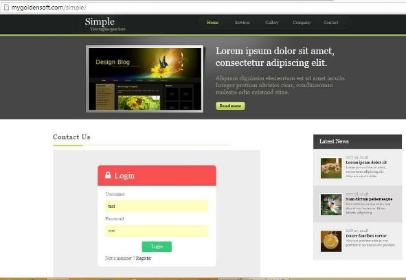

**Examples on CMS Integration** 

- Integration with Wordpress 

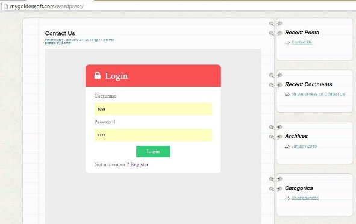

- Integration with Joomla 

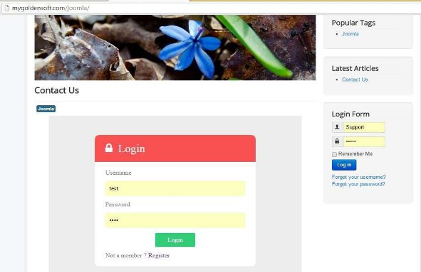

- Integration with Drupal 

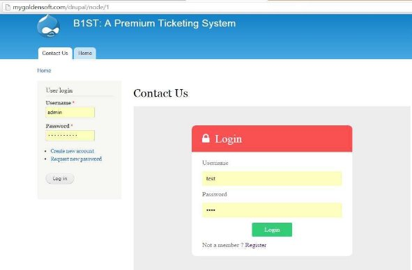

- Integration with Prestashop 

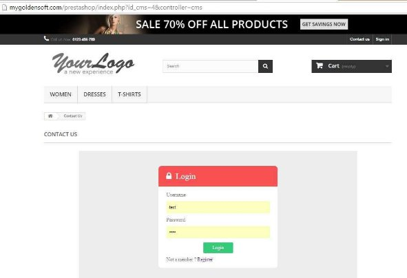

**First login**

- Login to the admin-panel with valid credential ( Initially usern-name : admin & password: admin) after login admin can change it. on clicking Login admin successfully will login into ticketing system as super-admin with all privilege. 

- It is recommended to change password then 
- To logout : from top menu click Logout
- Login to the frontend-panel with valid credential ( Initially usern-name : test & password: test)

**Modules**

B1st comes with 27 built-in modules that enable you to get wide variety of functionality supported with the most secure and reliable layers. each module is dedicated for a specific functionality.

1. Company Module
1. Product Module
1. Department Module
1. Users &  Admins Module
1. Knowledge Base Module [Based on product. if Product Module is disabled then these module will be disabled]
1. FAQ [Based on product. if Product Module is disabled then these module will be disabled]
1. Backup Module
1. Chat Module
1. Response Time Module
1. OPSWAT [Threat checking]
1. AKISMET[Spam checking]
1. Email Ticket Module ( to allow receiving emails via IMAP into B1ST) 
1. Twitter Module ( to allow receiving tweets into B1ST)
1. Mobile Verifications Module
1. Statistics Module
1. Rating Module
1. Languages & Locale Module
1. Theme & Styles Module
1. Uploads & Attachments Module
1. Registration Module
1. Priority Module
1. Privilege Module
1. Search & Filter Module
1. Ticketing Module
1. Settings Module
1. Configuration Module
1. Status Module

Among the 27 Modules B1ST comes equipped with, the are 12 core modules while the other 15 modules are premium ones but still you can activate them from your end for free. 

Core Modules

1. Department Module
1. Users &  Admins Module
1. Languages & Locale Module
1. Theme & Styles Module
1. Uploads & Attachments Module
1. Registration Module
1. Priority Module
1. Privilege Module
1. Search & Filter Module
1. Ticketing Module
1. Settings Module
1. Status Module

Premium Modules

1. Company Module
1. Product Module
1. Knowledge Base Module [Based on product. if Product Module is disabled then these module will be disabled]
1. FAQ [Based on product. if Product Module is disabled then these module will be disabled]
1. Backup Module
1. Chat Module
1. Response Time Module
1. OPSWAT [Threat checking]
1. AKISMET[Spam checking]
1. Email Ticket Module ( to allow receiving emails via IMAP into B1ST) 
1. Twitter Module ( to allow receiving tweets into B1ST)
1. Mobile Verifications Module
1. Statistics Module
1. Rating Module
1. Configuration Module

**Adding Basic Data**

**Adding new Company**

- Select **Company** from **Main** menu. Manage Companies window will open with existing departments list if any. 

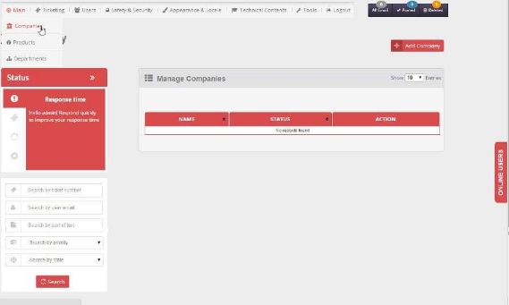

- Click **Add Company** button to add new department. **Add Company** form will open. Set company name and valid website URL [both combination should be unique]  then click on **add** button, “**Company added successfully”**  notification will display at header to confirm the addition. 

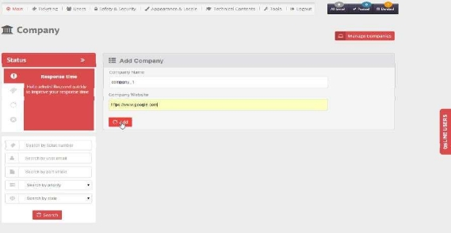

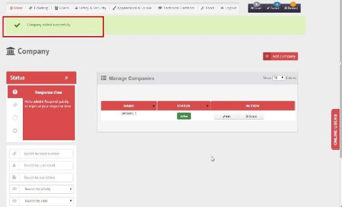

- You can use **delete icon** to delete a company (only if has no associated tickets at all). 
- You can use **edit icon** to rename a company's name (Duplicate Entry not possible). 

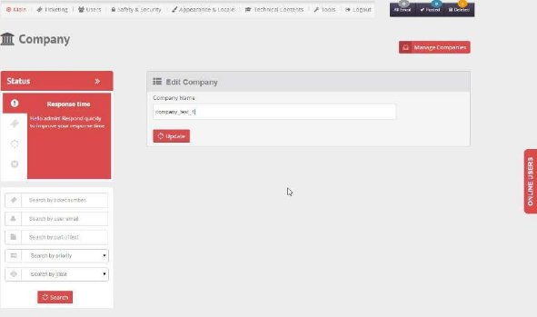

- You can activate/deactivate a company any time by clicking **Active-Inactive** button. When a company is active it will appear in companies list and be available to select; on the other hand when a company is inactive it will not be listed, and thus could not be selected. 

**Adding new Department**

B1ST allows a customer to send his inquiry to the proper department, whether it is the sales, support, billing, affiliation, participation, or whatever department you define in the admin panel. 

- Select **Department** from **Main** menu. Manage Departments window will open with existing departments list if any. 

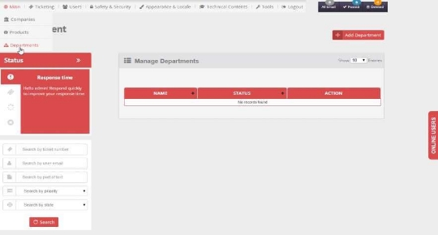

- Click **Add Department** button to add new department. **Add Department** form will open. Set department name [should be unique] then click on **add** button, “**Department added successfully”** notification will display at header to confirm the addition. 

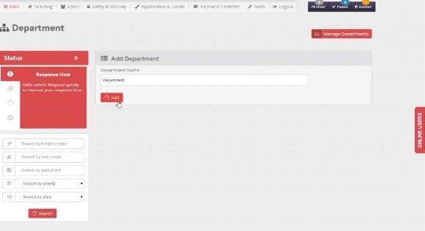

- You can use **delete icon** to delete a department (only if has no associated tickets at all). 
- You can use **edit icon** to rename a department’s name (Duplicate Entry not possible). 

- You can activate/deactivate a department any time by clicking **Active-Inactive** button. When a department is active it will appear in department list and be available to select; on the other hand when a department is inactive it will not be listed, and thus could not be selected. 

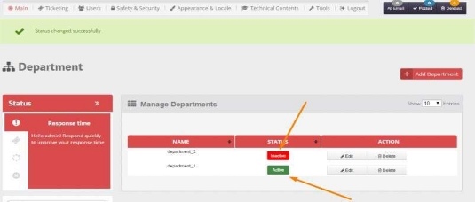

**Adding Ticket's Priorities**

- Select **Priority** from **Main** menu. Manage Priories window will open with existing departments list if any. 

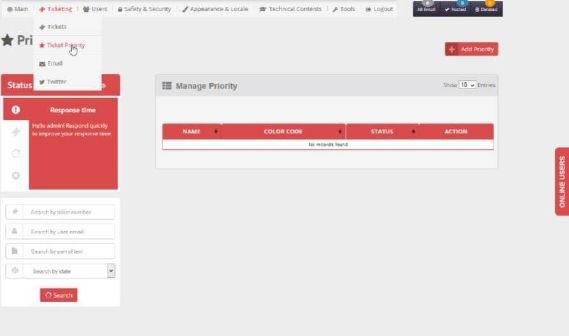

- Click **Add Priority** button to add new department. **Add Priority** form will open. Set priority name and color from color picker [both combination should be unique] then click on **add** button, “**Priority added** 

**successfully”** notification will display at header to confirm the addition. 

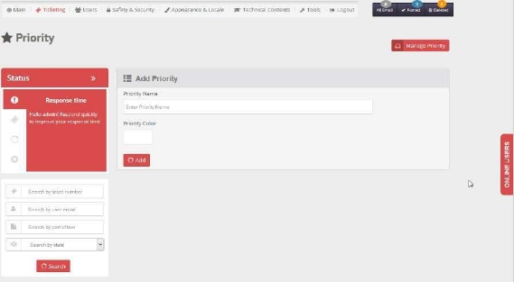

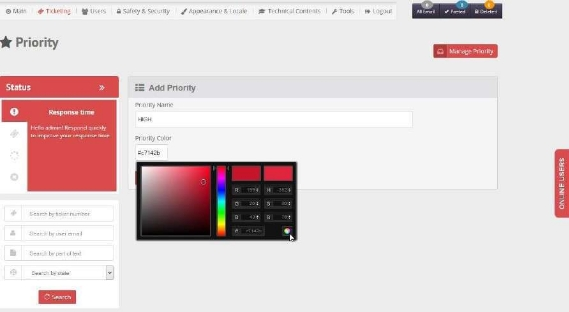

- You can use **delete icon** to delete a priority (only if has no associated tickets at all). 
- You can use **edit icon** to rename a priority's name (Duplicate Entry not possible). 

- You can activate/deactivate a department any time by clicking **Active-Inactive** button. When a department is active it will appear in department list and be available to select; on the other hand when a department is inactive it will not be listed, and thus could not be selected. 

**Ticketing**

**Adding Tickets**

1. Select Ticketing  from top menu, Manage Tickets panel will open with list of ticket.
1. For the first time any posted ticket is assign to super-admin, then you may

Assign Ticket: admin can assign ticket to other admin for one time, will not able to reassign ticket again.

Transfer Ticket: Admin be able to transfer ticket from first assign admin to other admin.

Add Ticket: Admin be able to add ticket from admin panel

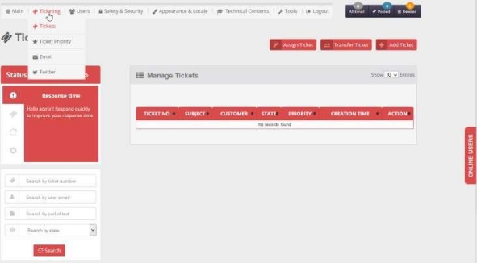

3. To Add Ticket : Enter subject, Customer Email, Select Company, Department, Product, Priority from drop down, Enter Query and Upload files.

` `Upload Settings ( Allowed Files, Max No Of Upload) , Showing progress bar of uploading process Click on add ticket 

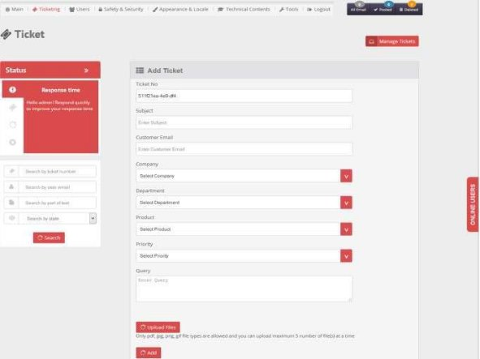

- All field are mandatory except upload file, will display notification for blank submission

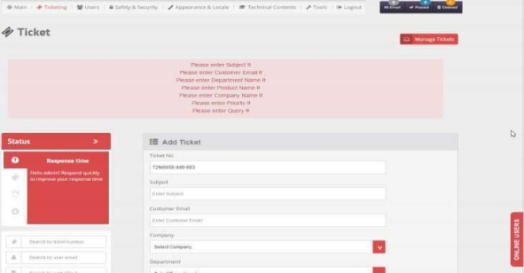

**Receiving emails as tickets**

No matter what your email provider is, B1ST will allow you to receive your emails directly to your B1ST message board. B1ST can be integrated to receive any Gmail account, or Yahoo accounts. As a double- spam protection, these messages will be scanned by A.Kis.Met API in addition to the detection methods used by your email provider, e.g., Gmail. 

And finally, if these messages have any attachments, they will be scanned for any virus or malware by OPSWAT Metascan API. 

- Select Email from Ticketing top menu IMAP Email window will open with blank email list for à

first time  since no email is fetched.

- Click on refresh button in right panel for fetching mail from given email id in settings tab.

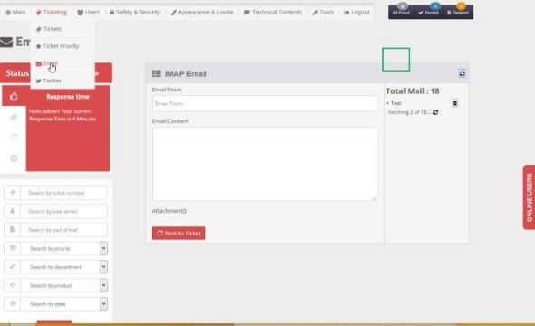

- Once move to other page without finishing the email fetching task, job will be paused , navigate back to Email page and click on refresh icon will start the fetching job again.

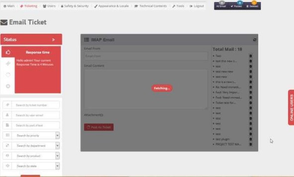

- Select an email from right panel it will fetch to the adjacent section with email\_ id, content and attachment if any.

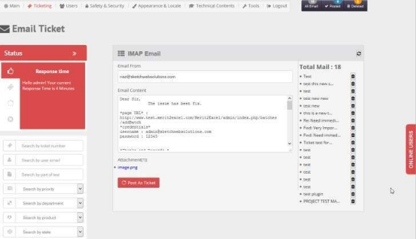

- To Post this email as ticket,  fill up the details like subject, company, department, product and priority, edit content then click Post as Ticket button.

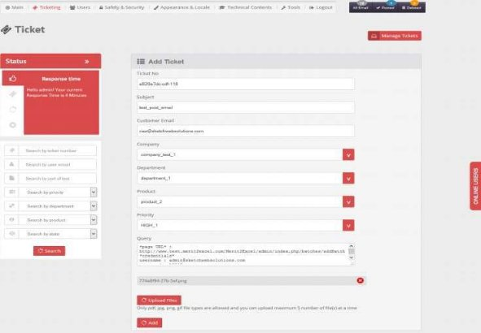

- Post this email as ticket will update the mail status as [P] in email module
- Beside top menu( right side) - in notification box-  admin can  check All email count, Posted email count, and Deleted email count

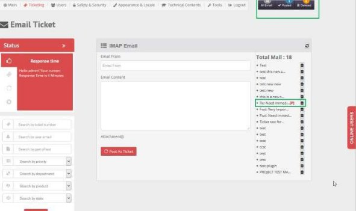

- To  Delete email from Total fetched mail click on Delete icon. 

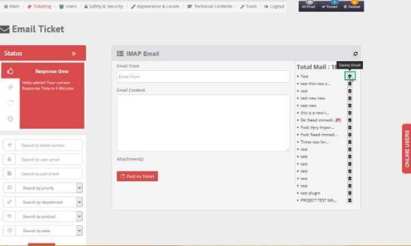

- Next image shows number of total email decreased by one ( from 18 into 17) , on the other hand total number of deleted emails increased by one ( from 0 to 1)

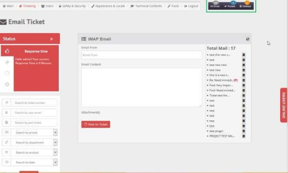

**Receiving Tweets as tickets**

- Select Twitter From Ticketing top menu.  Twitter Module window will open with blank tweet list for first time since no tweet is fetched.

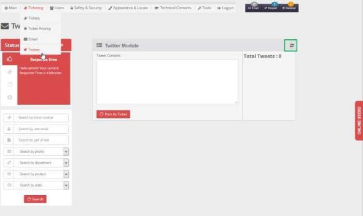

- Click  Refresh icon in right panel for fetching tweets from given twitter account as set in settings tab

- Once move to other page without finishing the tweet fetching task, job will be paused. Navigate back to twitter page and click Refresh icon to start the fetching job again
- Select a tweet from right panel will fetch it to the adjacent section with tweet content

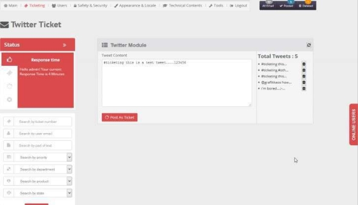

\5. To Post Tweet as Ticket,  fill up the details like subject, company, department, product and priority, edit content then click Add button.

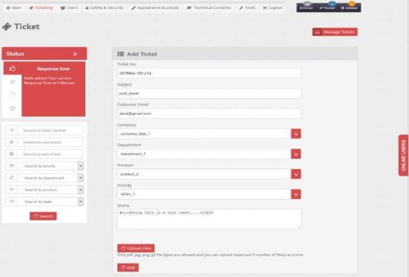

- Post this tweet as ticket will update the tweet status as [P] in Twitter module

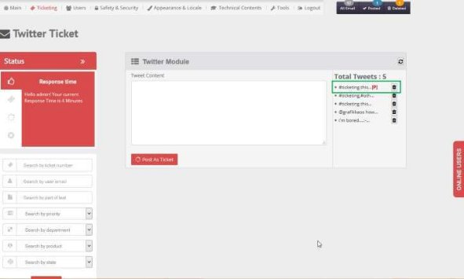

**Ticket's Status**

We refer to the left-upper section as Status-Section. It  shows some useful information related to each Admin. This info includes:

- Response time

- Average Rating

- Total Number of Ticket Replied

- Lowest Rated Tickets

**Filtering Tickets**

Message-board has a section where an admin can filter/search  messages by different ways. We refer to this section as Filtering-Section. In this section you can filter tickets by:

- Priority
- Department
- Product
- State

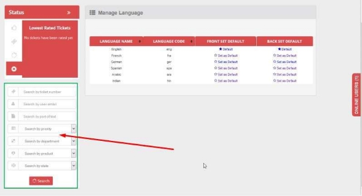

**Searching for a Ticket**

Message-board has a section where an admin can filter/search  messages by different ways. We refer to this section as Filtering-Section. In this section you may search for a ticket by:

- Ticket number
- User email
- Part of text

**Statistics**

B1ST gives you clear insight about your messages breakdown according to a message's state and its priority.

- Select Statistics for Tools top menu. Statistics page will open with charts of the following breakdown:
- Tickets
- Companies
- Department
- Product
- Priorities
- Ticket States
- Average response time
- Average Rating

.

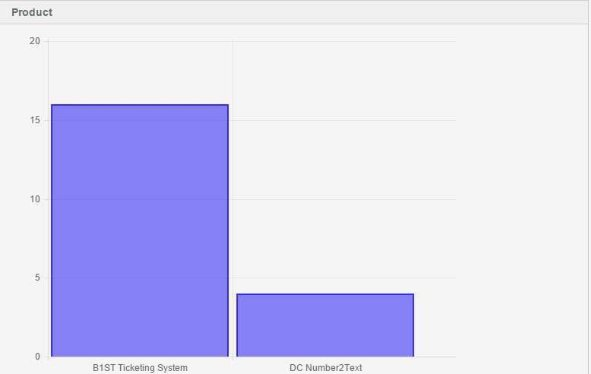

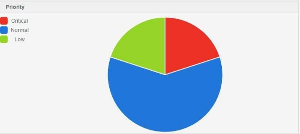

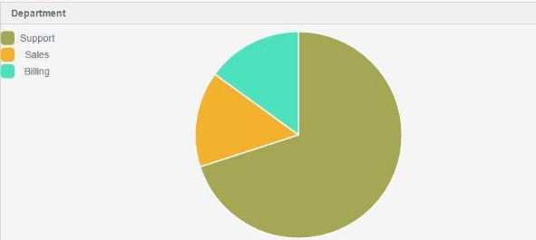

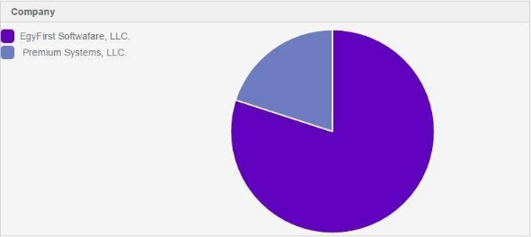

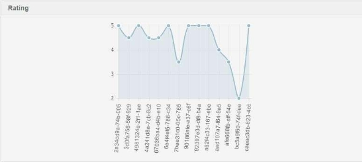

- There is a period list-box from which you can select the time period up to which the charts will be populated.
- A custom date is also provided from which you can select custom start and end date.

**Product's Functionality**

**Adding new Product**

B1ST allows a customer to send his inquiry to the proper product department support team; thus, if you have multiple products, each message will be sent to the proper department. 

- Select **Product** from **Main** menu. Manage Products window will open with existing products list if any. 

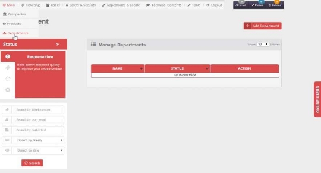

- Click **Add Product** button to add new product. **Add Product** form will open. Set product name [should be unique] then click on **add** button, “**Product added successfully”** notification will display at header to confirm the addition. 

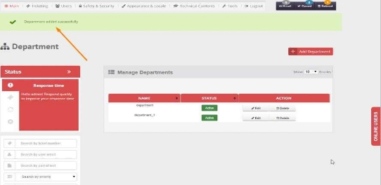

- You can use **delete icon** to delete a product (only if has no associated tickets at all). 
- You can use **edit icon** to rename a product's name (Duplicate Entry not possible). 

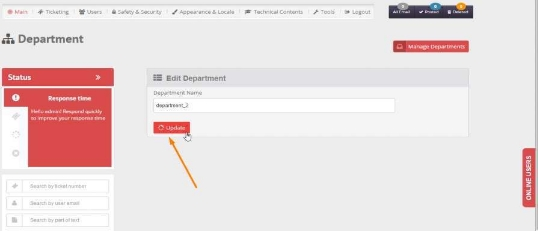

- You can activate/deactivate a product any time by clicking **Active-Inactive** button. When a product is active it will appear in product list and be available to select; on the other hand when a product is inactive it will not be listed, and thus could not be selected. 

**Adding FAQs**

- Select FAQ from  Technical Contents top menu. Manage FAQs page will  open with existing FAQs if any

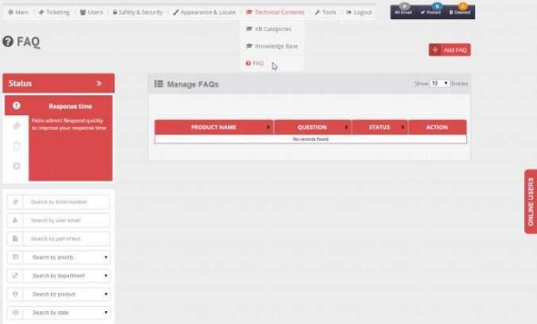

2. To insert new FAQ, click Add FAQ . Add FAQ form will open.  Each FAQ has two parts ( Question & Answer) . Each FAQ is assigned to a product.

Select  Product  name  from  drop  list,  set  question  and  answer  [both  product  and  Question combination should be unique]  click  Add button.

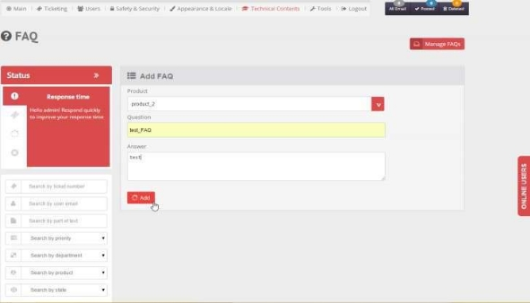

- On adding FAQs, FAQ added successfully, notification display at header.
- To Delete FAQ, click Delete icon

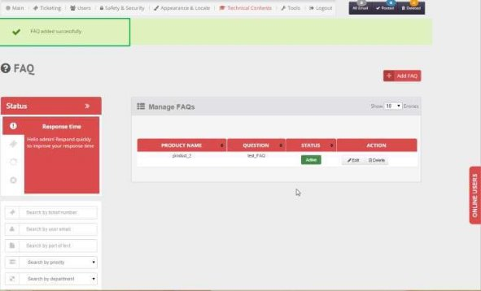

- To Edit FAQ, click Edit icon ( Duplicate Entry not possible.

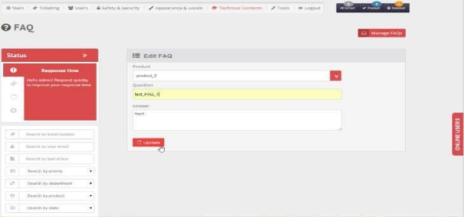

- You can activate/deactivate a proFAQ any time by clicking **Active-Inactive** button. When a product is active it will appear in FAQs list and be available to select; on the other hand when a FAQ is inactive it will not be listed, and thus could not be inserted or displayed 

. 

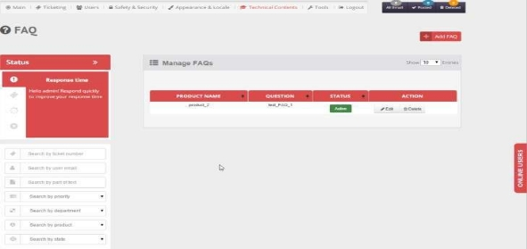

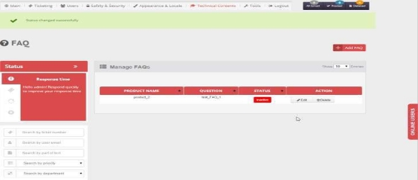

**Canned Messages**

- In message board, FAQs can pop-up to select an answer and insert it immediately as Reply to the ticket, which we refer to as Canned Messages. 
- Select Tickets form Ticketing top menu to view all tickets, then view any ticket you want to reply to by clicking Edit icon. Reply page will open.
- Click Answer from FAQà pop up page will open with all the FAQs associated to the  product related to  that ticket.

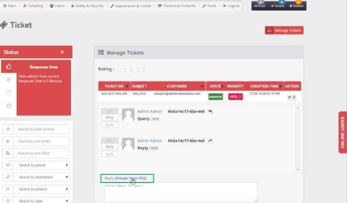

- Select answer you want use as fast reply then click  insert.

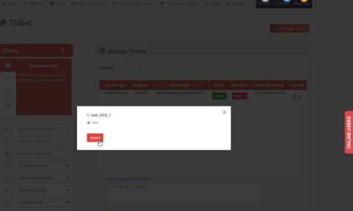

- Answer will be inserted on to the reply window.

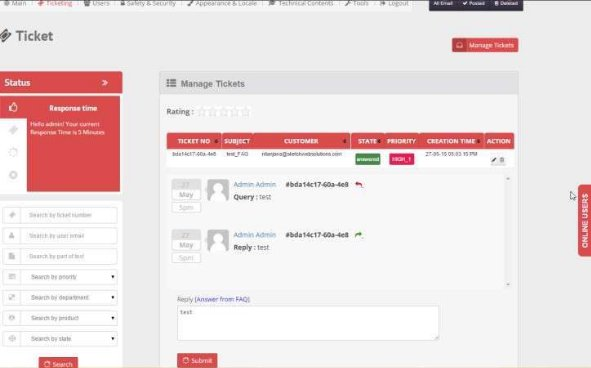

**Knowledge-Base**

- We refer to Knowledge Base as KB
- Select Knowledge Base Category  from Technical Contents top menu. Manage Knowledge Base Categories window will open with existing Knowledge Base Categories list if any.

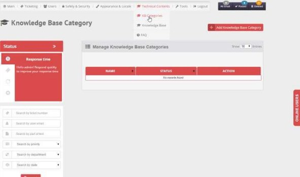

- To Add new knowledge- base category click Add Knowledge Base Category , button, a new window will open Set KB Category name [should be unique], then click Add

à

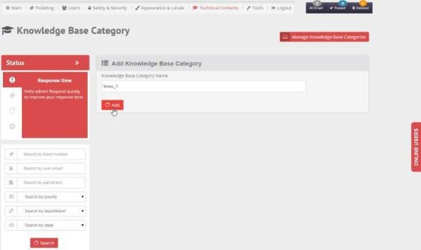

- To Delete KB Category ( only if has no associated KB at all) , click Delete icon

- To Edit KB Category, click Edit icon, enter new entry [should be unique], then click Update button

- You can activate/deactivate a KB category any time by clicking **Active-Inactive** button. When a KB category is active it will appear in product list and be available to select; on the other hand when a KB category is inactive it will not be listed, and thus could not be selected. 

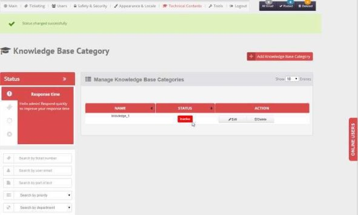

- Ability to search in Knowledge base 
- Search by Topic
- Filter by Products
- Filter by Companies

- To add KB-topic select Knowledge Base  from Main top meny. Add Knowledge Base form will open.  Select Category and  Product from drop-down list, set topic and content [combination of  Category, Product, topic and content should be unique]  then click  Add button.

- To Delete KB-topic, click Delete icon.

- To Edit  KB-topic, click edit icon, update data as required then click Update button.  Duplicate Entry not

possible( category, product and topic combination should be unique) .

- You can activate/deactivate a KB-topic any time by clicking **Active-Inactive** button. When a KB-topic is active it will appear in companies list and be available to select; on the other hand when a KB-topic is inactive it will not be listed, and thus could not be selected. 

**Customization**

` `B1ST is fully customized. You can choose your themes & styles, define which fields to appear on a customer contact form, and which spam method to use. You can even define which color your reCATCHA will appear in. All this and more. That is why you should try it yourself. 

**Themes**

B1ST comes with 7 built-in styles for your frontend & backend in addition to the capability to create any new styles of yours with no limit. 

- Select Theme  from  Appearance & Locale top menu.  Manage Theme window will open with seven built-in colored themes:
- Red
- Blue
- Grey
- Light
- Dark
- Green
- Orange 

- To Add theme: set theme name and select color from color picker ( both theme name and theme color combination is unique) , then click on Add 

[NB: color code should be in valid format, otherwise display notification] 

- Here, theme is added successfully and this newly added theme is editable and even can be deleted ( built-in themes can not be deleted) . 

- You can set  a theme for front-end while set another theme for back-end. thus you can use a theme that match with your website colors while keep the backend theme which you feel comfort with as it without any change.
- While any theme is set irrespective of backed or front end , it cannot be edited 

**Languages**

- Select Language from  Appearance & Locale top menu.  Manage language window will open with existing language list
- English 
- French
- Germany
- Spanish
- Arabic
- Indian 

- You can set a specific language for frontend which use different one for backend. e.g. you may set language Indian at frontend and Arabic at backend ( admin panel) .

3. Front end language set to hindi 

**Responsiveness**

B1ST will show properly on most devices. Thanks to responsive template used based on 16 column grid.

- Contact Form

- Admin Panel

**Configuration & Settings**

**Settings**

- Select Settings from Tools top menu. Manage Settings window will open with existing Settings list Vertical tabs)

- Admin Email: which email account will receive emails as tickets.
- IMAP Settings: settings from email provider that allows this email account to receive emails via IMAP.
- Upload Settings: set which type of files user will be able to upload ( multiple uploads via frontend & backend) and setting maximum number of uploads at one shot.
- Mobile Verification API Settings:  uses cognalys.com API to verify a mobile number. Two text boxes to enter app id  and access token. During registration mobile verification may be required or be 

optional.

- There are three states of any mobile number:
- Not Correct: this means no one can make a call to this number.
- Correct: this means we can call this mobile number, but we need to verify that the user own it, since it may be someone else mobile number.
- Verified: this means we can call the user who own this mobile number.
- reCAPTCHA Settings: allows reCAPTCHA in fronend and to define color of reCAPTHA.
- Ticket Auto Close Settings:  duration for a ticket to close automatically no matter what is its status.
- Backup Settings:  scheduled database backup based on setting option.
- Page Settings: default No. of records to show per page.
- Ticket Time Settings: - time for posted ticket can be displayed in two different styles
  - as elapsed time since it was posted
  - as time of posting
- Ticket Delete Settings any deletion can be confirmed first of deleted immediately without any warning. 
- AkisMet Settings: enter your AkisMet API
- OPSWAT Settings: enter your OPSWAT credentials.
- Auto Responder Settings: Sends an Auto-Responded email to user after a ticket is posted if enabled.
- Response Time Settings:  Sends an Auto-Responded mail to user after ticket post if enable
- Twitter API Settings:  enter your twitter application credential to allow receiving tweets and posting any of them as tickets.

**How to configure B1ST**

Among the 27 Modules B1ST comes equipped with, the are 12 core modules while the other 15 modules are premium ones.

- To install premium modules: click Install link for each module. successful installation indicated by green highlight. Now Uninstall and on-off options are available.
- Activate  each  module  by  clicking  on-off  button,  successful  activation  and  deactivation notifications display respectively.

N.B. While activate product module FAQ and Knowledge Base Module are available for installation, furthermore deactivate product

module FAQ and Knowledge Base Module will not available in configuration to install. Refer 2nd image.

**Security & Safety**

**Backup data & Restore them**

Are you worried about your customers messages and what accidents may happen to your server. Do not worry, **B1ST** allows you to generate backup of your messages database, as many as you wish to, with a push of a button. 

- Select **Backup** from **Safety & Security** menu. **Manage Backup** page is opened with existing backup file list if any along with the creation date when the backup was taken. 

- Click on the "Restore" button, to restore all the data backup earlier.  [ **CAUTION** ] : All current data will be lost if backup is restored. 
- Click on the "delete" button, to delete the backup. 
- Click on the "download" button, to download the **SQL file** as zip to the local computer. Later it can be used to restore again. 
- Click on **Backup Now** button a pop up will appear from there backup of the whole data of the TS can be taken based on the selected Backup Type option.  
- Data+Config : backup the whole data in database as well as config settings 
- Data Only : backup only the data and the settings. 
- Config Only : backup only the settings and not the data. 

After selecting the required options click on the Backup now button to create a backup image of the TS.It will be displayed in the list of backup in **manage backup** page. 

- Click on **Download all** to download a zip of all the backup in the backup lists. The zip backup can be restored again later. 
- Click on the **Download Attachments** to download a zip of all the attachment in TS. The zip can be uploaded again to restore the all the attachments. 
- Click on **Restore from File** , a pop up will appear. Select restore, then select a zip backup taken earlier by **download** / **Download All or** **Download Attachment**. After selecting click on the **Restore Now** button to restore the backup all files will be listed in the **manage backup** page. 

**Virus Protection**

B1ST makes use of OPSWAT Metascan API to scan any files attached to customers' messages; thus ensuring it is clean and not infected by any virus or malware that may damage your server security. 

**Why Multi-Scanning?** 

No single anti-malware engine is perfect 100% of the time. Using multiple engines to scan for threats allows you to take advantage of the strengths of each individual engine. 

**How to configure?** 

- Select Settings from Tools top menu. Manage Settings window will open with existing Settings list Vertical tabs)
- select Security Settings 
- enter your OPSWAT API credentials 

**Spam Detection & prevention**

- B1ST prevents spam by using 2 layers of authentication. 
- The first prevention layer by enabling reCAPTCHA to stop bot messages. 
- The second layer by integrating A.kis.met, the best automated spam killer that actually gets better as it learns. 
- **How to configure?** 
- Select Settings from Tools top menu. Manage Settings window will open with existing Settings list Vertical tabs)
- select Security Settings 
- enter your A.Kis>met API 

**Admins & Privileges**

**Adding Admin/Users**

- Select **Admin/Clients** from **Main** menu. Manage Users window will open with Admin & existing Users list if any. 

- Switch between clicking  **View Clients** & **View Admin**  to view desired list of Admin & users registered from the front end. 

- Click  Add **Admin/User**,  add user page will appear. Fill the form with the required fields and then click on “Add” to create a new Admin/User. 

- You can activate/deactivate a company any time by clicking **Active-Inactive** button. When a company is active it will appear in companies list and be available to select; on the other hand when a company is inactive it will not be listed, and thus could not be selected. 

**Setting Privileges**

B1ST allows you set up your admin roles. You can authorize who can close or delete messages, while allowing someone else to only close them, or you may not authorize him to close or delete messages, but just to reply to messages. 

- Select Privilege  from Users top menu. Manage Privilege window will open.

\2. To add new privilege, click Add Privilege button. A new window will open to enter privilege group name and description, assign privileges then click Add button.

To Delete privilege ( possible only if no admin listed under this privilege) , click Delete icon.

**Extras**

**Chat with clients**

- Once chat module is enabled from the configuration module, it will appear  at the right side user frontend as a button.

- On clicking the chat button list of available users to chat with will appear. Online users will be shown with a green symbols whereas offline users will be shown with a gray symbols.

- On clicking the online users a chat window will appear,  admin then can start chatting with that user.  If the user is offline he will get the chat after login immediately

- Admin can chat with multiple users whereas user can chat with only one admin at a time.

- Admin can also post the chat as ticket by clicking on“ Save this chat session as ticket

**Mobile Verification**

The most selling feature in B1ST ticketing system. it allows you to make sure the users enter a valid mobile numbers where you call back anytime. 

**How to configure?** 

- Select Settings from Tools top menu. Manage Settings window will open with existing Settings list Vertical tabs)
- Select Register Settings 
- enter your Conalys API credentials 

- Once set to required, user wont be able to register until enter a valid mobile number 

- user will receive a missed call from Cognalys.com. he should enter the last five digits of calling number to validate its mobile number 

- If he provide wrong last five digits of calling number he will be prevented from registrations 

**Attaching & Uploading Files**

B1ST allows your customers to attach files to their messages. But do not worry; you are still safe thanks to OPSWAT Metascan API. These attachments will be scanned using 30+ online virus & malware engines. Rest assured, you are in the safe hands. 

**Rating System**

**B1ST** allows advanced rating system where users can vote for each answer they receive as a reply from Admins. This helps a lot with the aid of Admin-Status where admin can check his average rating he received with regard to overall rating received from all other Admins.  

Also, an Admin can check how many bad rates he received (based on rating settings) 

- Average Rating

- Lowest Rated Tickets

**Response Time**

- *B1ST allows you to measure your average response times for all tickets replied by an admin.* 

- *This helps a lot with the aid of Admin-Status where admin can check his response time  with regard to a threshold defined by Super-Admin.*

**Auto-Respond Message**

B1ST can be configured to respond automatically to each message received on your message board; thus, customers make sure their messages are delivered to you. Additionally, you may leave them a message when they should receive a reply from you and your team's work hours & days off. 

**grAvatar**

Show you and your customer's grAvatar next to each message and their replies; that makes sense. Thus, you are a globally recognized avatar. 

**reCAPTCHA**

**How to configure?** 

- Select Settings from Tools top menu. Manage Settings window will open with existing Settings list Vertical tabs)
- Select Register Settings 
- enter your reCAPTCHA API 

o 

- **Set it to required to force it to appear to new customers on registration.** 

All rights reserved. 

EgyFirst Software, LLC. 2005-2016 
PAGE84 / NUMPAGES84
=======
# b1st
Free Premium Tickting System
help desk
developed in PHP
>>>>>>> ee1ef8ea64faf834ab8d969bc9e9ae6cc98cde3b
